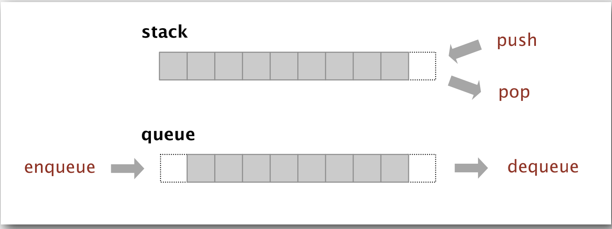

# 知识点
- stacks and queues

- ---
## Stacks and queues
栈是在先进后出,push和pop的操作在同一端(LIFO,last in first out)  
队列是先进先出,操作在两端(FIFO, first in first out)
   
 通常栈跟队列都是用数组实现的,数组空时最好要减少数组的长度,通常缩小为四分一,数组满时扩容,扩充一倍。一般是根据需要再建个数组(扩容或缩小长度都应该是已知的了),然后再把值赋进去就可以了。
 具体可以参考code/StacksAndQueues/src/main/java/Deque中的代码实现,其实就是作业2的答案。
## 排序
Java中实现排序通常是使用接口,通常实现Comparable,这个接口有个compareTo的方法  
具体可以看下面Date对象的源码,Date之所以可以比较大小是因为Date类实现了Comparable,并且实现了compareTo方法

```java
public class Date
    implements java.io.Serializable, Cloneable, Comparable<Date>
{
    public int compareTo(Date anotherDate) {
        long thisTime = getMillisOf(this);
        long anotherTime = getMillisOf(anotherDate);
        return (thisTime<anotherTime ? -1 : (thisTime==anotherTime ? 0 : 1));
    }

}

```
所以要一个可控制比较大小的类就是让其实现Comparable.  
还可以定义一些常用的方法
```jaca
private static boolean less(Comparable v, Comparable w) {
    return v.compareTo(w) < 0;
}

private static void exch(Comparable[] a, int i, int j){
    Comparable swap = a[i];
    a[i] = a[j];
    a[j] = swap;
}

```
## Selection sort,选择排序
选择排序用通俗的话讲就是从左到右扫描一遍,每次拿最左边的元素和右边的所有元素中最小的那个调换位置。
举例说明:5,7,8,6,2,1  
第一次排序:1,7,8,6,2,5; 5和1换  
第二次排序:1,2,8,6,7,5; 7和2换  
第三次排序:1,2,5,6,7,8; 8和5换  
第四次排序:1,2,5,6,7,8; 无交换就扫描6,7,8  
第五次排序:1,2,5,6,7,8; 无交换就扫描7,8  
第六次排序:1,2,5,6,7,8; 无交换就扫描8  
这样很明显了,假设数组长度为N,第一次扫描N-1，第二次N-2，。。。，+1+0~$N^2$  
## Insertion sort,插入排序  
插入排序的算法效率大概是~$\frac{1}{4} N^2$  
插入排序也是从左到右扫描,他保证当前索引左边的数组是有序的  
举例说明:5,7,8,6,2,1  
当前index 1对应元素7: 5,7,8,6,2,1  
当前index 2对应元素8: 5,7,8,6,2,1  
当前index 3对应元素6: 5,7,6,8,2,1 ; 5,6,7,8,2,1  
当前index 4对应元素2: 5,6,7,2,8,1 ; 5,6,2,7,8,1 ; 5,2,6,7,8,1 ; 2,5,6,7,8,1  
当前index 5对应元素1: 2,5,6,7,1,8 ; 2,5,6,1,7,8 ; 2,5,1,6,7,8 ; 2,1,5,6,7,8 ; 1,2,5,6,7,8  
插入排序对于小规模数据和基本有序的数据效果不错
## 希尔排序,shell sort  
希尔排序的出发点是插入排序,对于中等规模的数据性能还不错,具有很强的实用性  
它把较大的数据集合分割成若干个小组,然后对每一个小组分别进行插入排序,此时插入排序所作用的数据量比较小,插入效率比较高,同时因为每个分组进入插入排序虽然整体未必是有序的,但是可以说是整体部分有序,这又提高了效率,通常用于嵌入式系统或者硬件排序类的系统,因为实现它只需要很少的代码