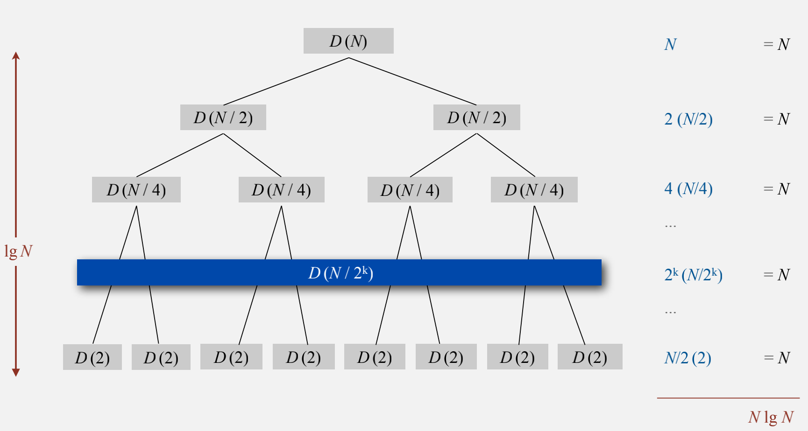

# 知识点
- 归并排序
- 快速排序
---  
## 归并排序  
归并排序的核心思想就是把数组一分为二,然后就有了两个数组,然后分别对数组进行排序,两个数组分别有序后再把两个数组合并,更具体的来说把一个数组不断的二分,直到二分的数组只有一个元素为止,然后将数组进行合并。  
归并排序的效率是$N*lgN$,其主要缺点则是它所需的额外空间和N成正比,具体分析如下图所示:

## 快速排序
快速排序流行的原因是它实现简单、适用于各种不同的输入数据切在一般应用中比其他排序算法都要快很多,其引人注目的特点包括它是原地排序(只需要一个很小的辅助栈),且将长度为N的数组排序所需的时间和NlgN成正比,我们目前学习的算法都无法将这两个优点结合起来。另外,快速排序的内循环比大多数排序算法都要短小,这意味着它无论是在理论上还是实际中都要快，它的主要缺点是非常脆弱,在实现时要非常小心才能避免低劣的性能。

比较:
- 归并排序，简单来说就是先将数组不断细分成最小的单位，然后每个单位分别排序，排序完毕后合并，重复以上过程最后就可以得到排序结果。快速排序，简单来说就是先选定一个基准元素，然后以该基准元素划分数组，再在被划分的部分重复以上过程，最后可以得到排序结果。两者都是用分治法的思想，不过最后归并排序的合并操作比快速排序的要繁琐
- 归并排序是稳定的,而快速排序不稳定,稳定性就是说相同大小的元素,排序之后他们的顺序和原来一致,例如A:1,B:2,C:1,那么 排序成ACB和CAB都是一致,如果每次都是ACB或CAB那么就是稳定的排序结果