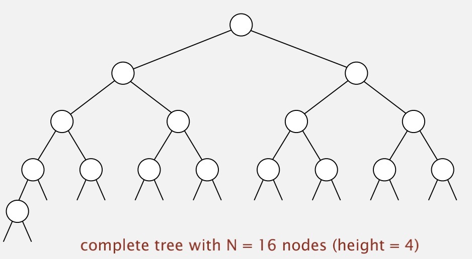
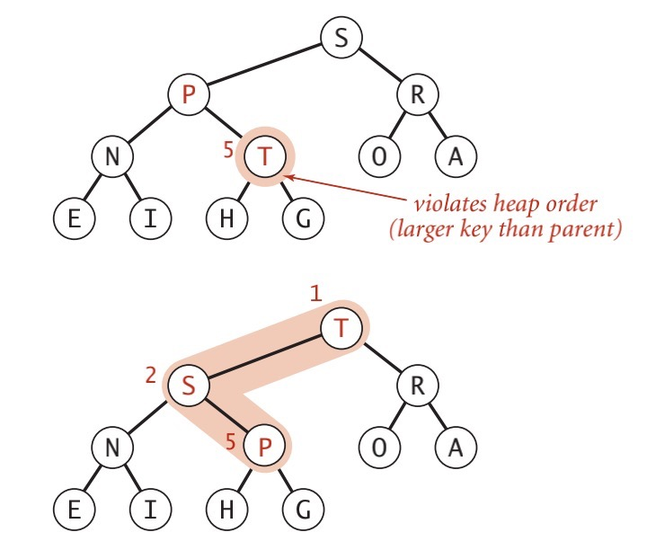
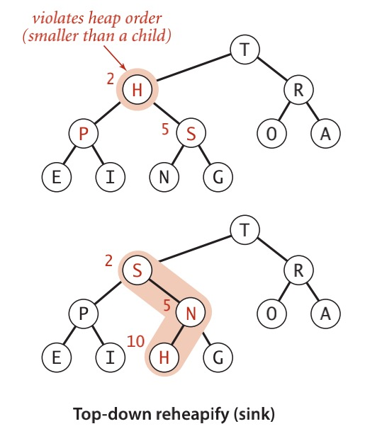
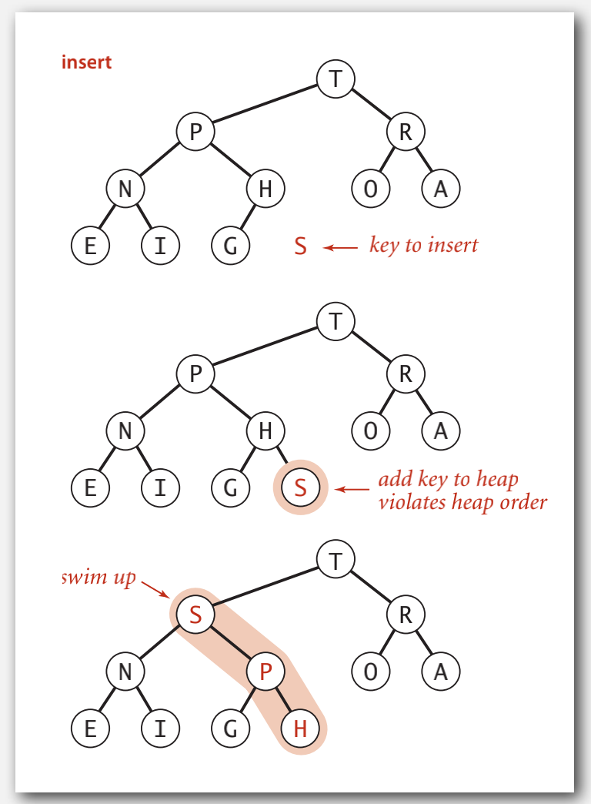
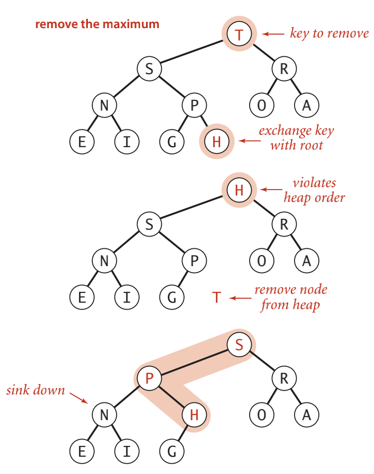

# 优先队列
- <a href="#01">API and elementary implementations</a>
- <a href="#02">binary heap</a>
- <a href="#03">堆排序</a>
  
---

## <a id="01">API and elementary implementations</a>
一个合适的数据结构应该支持两种操作:删除最大元素和插入元素。这种类型叫做优先队列  
一个优先队列最重要的操作就是delMax()和insert(),接下来给出一个优先队列的API：

```java
public class MaxPQ<Key extends Comparable<Key>> {
    MaxPQ()
    MaxPQ(Key[] a)
    void insert(Key v)
    Key delMax()
    boolean isEmpty()
    Key max()
    int size()
}
```
根据上诉优先队列其实可以理解为一个可以删除和插入的集合,具体的实现有很多种,以下为部分例举:
- Stack:弹出最近添加的
- Queue:弹出最后添加的
- Randomized queue:随机弹出一个
- Priority queue:弹出最大或最小的  
- 
其实有经验的工程师已经看出来了,最基本的实现就是去栈或队列中找最大或最小值,实现优先队列的方式其实最重要还是看它的时间复杂度和空间复杂度

|implement|time|space|
|----|----|----|
|sort|NlogN|N|
|elementary PQ| MN| M|
|binary heap| N log M| M |
|best in theory| N | M |

显然我们的目标就是要找平均效率为logN的insert、del max、max的实现  
接下来看一个具体实现:
```java
public class UnorderedArrayMaxPQ<Key extends Comparable<Key>> {

    private Key[] pq;
    private int N;

    public UnorderedArrayMaxPQ(int capacity) {
        pq = (Key[]) new Comparable[capacity];
    }

    public boolean isEmpty() {
        return N == 0;
    }

    public void insert(Key x) {
        pq[N++] = x;
    }

    public Key delMax() {
        int max = 0;
        for(int i=1; i<N; i++) {
            if(less(max, i)) {
                max = i;
            }
        }
        exch(max, N-1);
        return pq[--N];
    }

    private boolean less(int i, int j) {
        return pq[i].compareTo(pq[j]) < 0;
    }

    private void exch(int i, int j) {
        Key swap = pq[i];
        pq[i] = pq[j];
        pq[j] = swap;
    }
}
```
|implement|insert|del max|max|
|----|----|----|----|
|unordered array|1|N|N|
|ordered array| N| 1 | 1 |
|goal| logN | logN | logN |


## <a id="02">binary heap</a>

二叉堆能够很好的实现优先队列的基本操作,在二叉堆的数组中,每个元素都要保证大于等于另外两个特定位置的元素。相应的这些位置的元素又要大于等于数组的另两个元素。  


---

定义:当一颗二叉树的每个结点都大于等于它的两个子节点时,它被称为堆有序。  
在堆有序的二叉树中,每个节点都小于等于它的父节点(如果父节点存在,所以根通常是最大或最小的)。从任意节点向上,我们都能得到一列非递减的元素;从任意节点向下,我们都能得到一列非递增的元素  
在一个堆中位置k的节点的父节点的位置为floor(k/2),而其两个子节点分别为2k和2k+1  

### 由下至上的堆有序化(上浮)
就是节点的优先级上升
```java
private void swim(int k) {
    while(k > 1 && less(k/2, k)) {
        exch(k/2, k)
        k = k/2
    }
}
```


---

### 由上至下的堆有序化(下沉)

就是节点的优先级下降
```java
private void sink(int k) {
    while(2*k <= N) {
        int j=2*k
        if(j < N && less(j, j+1)) j++;
        if(!less(k,j)) break;
        exch(k,j);
        k = j
    }
}
```


接下来我们讨论插入元素和删除元素:  
 - 插入元素:我们将新元素插入到数组末尾,增加堆的大小并让这个元素上浮到合适的位置
 - 删除最大元素:我们从数组顶端删去最大的元素并将数组的最后一个元素放到顶端,减小堆的大小并让这个元素下沉到合适的位置
```java
public void insert(Key x) {
    pq[++N] = x;
    swim(N)
}
```



```java
public Key delMax() {
    Key max = pq[1];
    exch(1, N--);
    sink(1);
    pq[N+1] = null;
    return max;
}
```



|implement|insert|del max| max |
|----|----|----|----|----|
|unordered array| 1 | N | N|
|ordered array| N | 1 | 1|
|binary head| logN | logN | 1
|d-ary heap| $log_dN$| $d log_d N$| 1 |
|Fibonaci| 1 | logN (amortized) | 1|
|impossible| 1 | 1| 1 |

## <a id="03">堆排序</a>
我们可以把任意优先队列变成一种排序方法。将所有元素插入一个查找最小元素的优先队列,然后再重复调用删除最小元素的操作来将他们按顺序删去。用无序数组实现的优先队列这么做相当于进行一次选择排序。  

堆排序是利用堆这种数据结构而设计的一种排序算法,堆排序是一种选择排序,其最坏、最好,平均时间复杂度为O(nlogn),是不稳定算法。  

堆排序分为两个阶段:在堆的构造阶段中,我们将原始数组重新组织安排进一个堆中;然后再下沉排序阶段,我们从堆中按递减顺序取出所有元素并得到排序结果。  

堆排序的基本思想是：将待排序序列构造成一个最大堆，此时，整个序列的最大值就是堆顶的根节点。将其与末尾元素进行交换，此时末尾就为最大值。然后将剩余n-1个元素重新构造成一个堆，这样会得到n个元素的次小值。如此反复执行，便能得到一个有序序列了,什么意思呢?先复习下堆定义:当一颗二叉树的每个结点都大于等于它的两个子节点时,它被称为堆有序。  
首先看一个初始数组:  
<div align="center">
4,6,8,5,9
</div>
将其构造为最大堆:
<div align="center">
9,6,8,5,4
</div>
接下来进行堆排序,先交换第一个最大元素和最末尾的元素:
<div align="center">
4,6,8,5| 9
</div>
看到了吗?这样的话9这个元素就是有序的,因为是最大嘛,然后将剩下的元素也就是4,6,8,5重新构造为堆:
<div align="center">
8,6,4,5| 9
</div>
这样n-1个元素就构造为了堆有序,然后继续交换这个n-1的堆的第一个和最后一个元素:
<div align="center">
5,6,4| 8,9
</div>
这样一来8,9就是有序的了,然后我们继续将剩下的n-2构造为最大堆,然后继续交换第一个和最后一个,这样一来最后就有序了。

```java
public static void sort(Comparable[] a) {

    int N = a.length;
    
    for(int k=N/2; k>=1; k--) {
        sink(a,k,N);
    }

    while(N > 1) {
        exch(a, 1, N--);
        sink(a, 1, N);
    }
}
```

<style>
table {
    margin: auto;
}
</style>