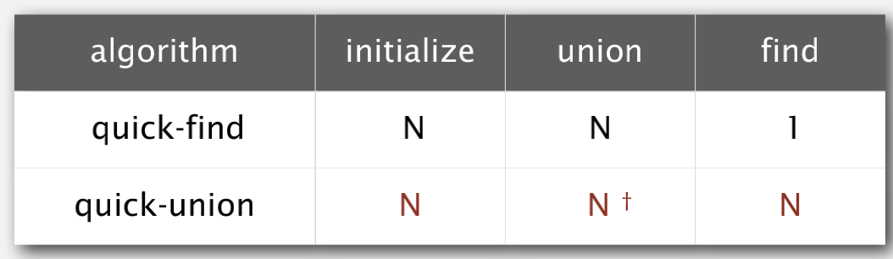

# 知识点  
- 并查集  
   - dynamic connectivity  
   判断各个节点是否连通,常用的方法有两个:connected(a,b),union(a,b);connected返回布尔值判断a,b是否连通,union连通a,b。  
   连通问题应用广泛,例如是否可以在p和q之间建立桥梁,通信线路,这些字符或整数对还可表示社交网络。  
   假设现有集合:{1,...,10},经过连续的union的后连通的组件称为connected components,所以至少有一个connected components  
     
   - Quick Find  
   为解决dynamic connectivity问题,我们提出了Quick Find算法,其本质上是一种贪心算法,例如union(3,4),要把id[4]=3,若再连通union(8,3),要把id[3]=8,同时要把3连通的对象4也要进行修改:id[4]=8,最终判断两个节点是否连通仅要看看他们对应的id值是否相同即可。  
     
     
   但是Quick-find太慢了,无法处理大型问题,因为对于每一对输入union()都需要扫描整个id[]数组。它是一个平方量级的算法,是一个平方量级的时间太慢了,对于大型的问题没有办法接受需要平方时间的算法,当计算机变得更大更快,平方时间算法实际上变得更慢了
   - Quick Union  
   为解决Quick Find太慢的问题,提出第一个解决方案Quick union,其实是把节点按树一样组合起来,例如union(5,6),节点5的位置存放其根值6,最后我们判断两个节点是否连通我们需要回溯这个两个节点的connected component,看其根节点是否相等,相等则表示连通   
     
   合并仅需要修改数组的一个项即可,查找需要更多的操作,而这个查找树可能很高,所以查找的代价太大了,可能需要回溯一整棵瘦长的树,只进行查找操作就需要花费N次数组访问,感觉提出的新方案并没什么贵用...反而效率更低了  
     
   - Quick Union Improvements  
   上诉两种方案都不支持大规模的动态连通图,这里给出一个新的解决算法称为weighted quick-union,每棵树都带上权重,如果一棵大树和小树合并应该避免将大树放在下面,这样我们可以永远保证小树在下面,大树在上面  
     
   显然根据二叉树的理论,这棵节点为N的树的深度最多为lgN(2为底)  
     
   还有种方法称为路径压缩(path compression),就是把瘦长的树平展开,提高查询效率  
   <table>
   <tr>
      <td></img></td>
      <td></img></td>
      <td></img></td>
   </tr>
   </table>
   - summary  
   并查集算法不存在线性时间,带压缩路径的带权快速合并算法 已经足够接近线性算法了
- 算法分析